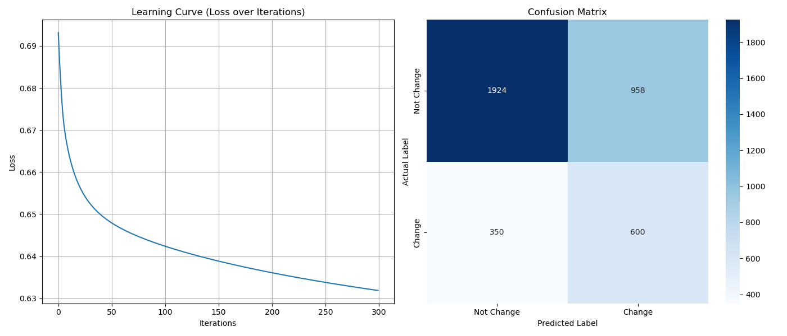

# HR Analytics: Job Change of Data Scientists Prediction


## 📑 Mục Lục
1. [Giới thiệu](#1-giới-thiệu)
2. [Dataset](#2-dataset)
3. [Phương pháp & Thuật toán](#3-phương-pháp--thuật-toán)
4. [Cài đặt & Hướng dẫn sử dụng](#4-cài-đặt--hướng-dẫn-sử-dụng)
5. [Kết quả thực nghiệm](#5-kết-quả-thực-nghiệm)
6. [Cấu trúc dự án](#6-cấu-trúc-dự-án)
7. [Thách thức & Giải pháp](#7-thách-thức--giải-pháp)
8. [Hướng phát triển (Future Improvements)](#8-hướng-phát-triển-future-improvements)
9. [Thông tin tác giả](#9-thông-tin-tác-giả)
10. [Đóng góp (Contributors)](#10-đóng-góp-contributors)
11. [Liên hệ (Contact)](#11-liên-hệ-contact)
12. [Giấy phép (License)](#12-giấy-phép-license)

---

## 1. Giới thiệu

### 1.1. Mô tả bài toán
Trong bối cảnh khoa học dữ liệu đang phát triển mạnh, các công ty đối mặt với vấn đề nhân sự ("churn") khi các Data Scientist thường xuyên thay đổi công việc. Dự án này xây dựng một mô hình Machine Learning để dự đoán xác suất một ứng viên sẽ **thay đổi công việc** hay không, dựa trên các thông tin nhân khẩu học và kinh nghiệm của họ.

### 1.2. Động lực & Mục tiêu
- **Động lực:** Giúp bộ phận HR tối ưu hóa quy trình tuyển dụng, giảm chi phí đào tạo bằng cách xác định ứng viên có ý định gắn bó lâu dài.
- **Mục tiêu kỹ thuật:**
    - Xây dựng quy trình Data Pipeline hoàn chỉnh (ETL, Preprocessing, Modeling).
    - **Đặc biệt:** Cài đặt thuật toán **Logistic Regression từ con số 0 (From Scratch)**.
    - **Ràng buộc:** Chỉ sử dụng thư viện **NumPy** để xử lý ma trận và tối ưu hóa tính toán (Không dùng Pandas cho khâu xử lý dữ liệu chính).

---

## 2. Dataset

- **Nguồn dữ liệu:** [Kaggle - HR Analytics: Job Change of Data Scientists](https://www.kaggle.com/datasets/arashnic/hr-analytics-job-change-of-data-scientists)
- **Kích thước:** ~19,158 dòng (Training set).
- **Đặc trưng (Features):** 13 cột, bao gồm dữ liệu hỗn hợp:
    - *Định lượng:* `city_development_index`, `training_hours`.
    - *Định tính/Phân loại:* `gender`, `relevent_experience`, `enrolled_university`, `major_discipline`.
    - *Có thứ tự (Ordinal):* `education_level`, `company_size`, `experience`.
- **Biến mục tiêu (Target):** `0` (Không đổi việc) và `1` (Muốn đổi việc).

---

## 3. Phương pháp & Thuật toán

### 3.1. Xử lý dữ liệu (Pure NumPy Implementation)
Do không sử dụng Pandas, quy trình xử lý dữ liệu được thực hiện thủ công thông qua các kỹ thuật thao tác mảng (Array Manipulation):

1.  **Loading Data:** Sử dụng `np.genfromtxt` với `dtype=None` và `encoding='utf-8'` để đọc dữ liệu hỗn hợp.
2.  **Handling Missing Values:**
    - Biến số: Thay thế bằng `np.nanmean` (Mean).
    - Biến phân loại: Thay thế bằng giá trị xuất hiện nhiều nhất (Mode) hoặc tạo nhóm `'Unknown'`.
3.  **Feature Engineering (Khó khăn nhất):**
    - `Experience`: Xử lý các chuỗi ký tự đặc biệt (`>20` $\rightarrow$ 21, `<1` $\rightarrow$ 0) bằng kỹ thuật masking.
    - `Company Size`: Ánh xạ (Mapping) thủ công sang thang đo thứ tự (Ordinal Encoding) từ 0 đến 7.
    - `City`: Tách chuỗi `city_103` để lấy mã vùng `103` làm feature số.
4.  **Normalization:** Áp dụng Min-Max Scaling để đưa tất cả feature về đoạn $[0, 1]$, giúp Gradient Descent hội tụ nhanh hơn.

### 3.2. Thuật toán: Logistic Regression (From Scratch)
Mô hình được xây dựng dựa trên nền tảng toán học:

- **Hàm giả thuyết (Hypothesis):** Sử dụng hàm Sigmoid.
  $$\hat{y} = \sigma(z) = \frac{1}{1 + e^{-z}}$$
  Trong đó: $z = X \cdot w + b$

- **Hàm mất mát (Cost Function):** Binary Cross-Entropy Loss.
  $$J(w,b) = -\frac{1}{m} \sum_{i=1}^{m} [y^{(i)}\log(\hat{y}^{(i)}) + (1-y^{(i)})\log(1-\hat{y}^{(i)})]$$

- **Tối ưu hóa (Optimization):** Gradient Descent.
  Cập nhật trọng số $w$ và bias $b$ sau mỗi vòng lặp:
  $$dw = \frac{1}{m} X^T (\hat{y} - y)$$
  $$db = \frac{1}{m} \sum (\hat{y} - y)$$
  $$w = w - \alpha \cdot dw$$

- **Kỹ thuật Vectorization:**
  Thay vì dùng vòng lặp `for` để duyệt qua từng mẫu dữ liệu (rất chậm), mô hình sử dụng phép nhân ma trận (`np.dot`) để tính toán trên toàn bộ tập dữ liệu cùng lúc, tăng hiệu suất lên hàng trăm lần.

  ### 3.3. Cân bằng dữ liệu (SMOTE from Scratch)
Để giải quyết vấn đề mất cân bằng dữ liệu nghiêm trọng, thuật toán **SMOTE (Synthetic Minority Over-sampling Technique)** được cài đặt thủ công:
- **Nguyên lý:** Tính toán khoảng cách Euclidean giữa các điểm dữ liệu thiểu số, tìm k-láng giềng gần nhất (KNN) và nội suy tuyến tính để sinh ra các mẫu dữ liệu mới.
- **Kỹ thuật NumPy:** Sử dụng Broadcasting để tính ma trận khoảng cách mà không cần vòng lặp lồng nhau, tăng tốc độ xử lý.

---

## 4. Cài đặt & Hướng dẫn sử dụng

### 4.1. Yêu cầu hệ thống
- Python 3.8+
- Thư viện: NumPy, Matplotlib, Seaborn.

### 4.2. Cài đặt
```bash
# 1. Clone repository
git clone https://github.com/trungkienjjj/HR_Analytics_Project.git
cd HR_Analytics_Project

# 2. Cài đặt thư viện
pip install -r requirements.txt
```

### 4.3. Chạy chương trình
Dự án được thiết kế để chạy tuần tự qua các Jupyter Notebook trong thư mục `notebooks/`:

1.  **Bước 1:** Mở `notebooks/01_data_exploration.ipynb`
    - Chạy toàn bộ để tải dữ liệu và xem thống kê mô tả, biểu đồ phân phối các đặc trưng.
2.  **Bước 2:** Mở `notebooks/02_preprocessing.ipynb`
    - Chạy để làm sạch dữ liệu, xử lý missing values, chuẩn hóa (Min-Max Scaling) và mã hóa (Encoding).
    - Kết quả sẽ tạo ra các file `.npy` trong thư mục `data/processed/`.
3.  **Bước 3:** Mở `notebooks/03_modeling.ipynb`
    - Chạy để load dữ liệu sạch, huấn luyện mô hình Logistic Regression tự viết và đánh giá kết quả.

---

## 5. Kết quả thực nghiệm

### 5.1. Bảng so sánh hiệu năng (Performance Comparison)

Dưới đây là bảng so sánh giữa mô hình **Logistic Regression tự cài đặt (NumPy)** và mô hình thư viện chuẩn (Scikit-learn).

| Metric | Custom Model (NumPy) | Sklearn (Baseline) | Nhận xét |
| :--- | :---: | :---: | :--- |
| **Accuracy** | 0.6587 | **0.7784** | Sklearn tốt hơn về độ chính xác tổng thể (do thiên về lớp đa số). |
| **Precision**| 0.3851 | **0.6105** | Sklearn ít báo động giả hơn. |
| **Recall** | **0.6316** | 0.2937 | **QUAN TRỌNG:** Model NumPy phát hiện được **gấp đôi** số người muốn nghỉ việc so với Sklearn. |
| **F1-Score** | **0.4785** | 0.3966 | Model NumPy cân bằng tốt hơn trên dữ liệu lệch. |

> **Kết luận:**
> Mặc dù Accuracy thấp hơn, mô hình tự xây dựng (có áp dụng SMOTE và tinh chỉnh tham số) đạt **Recall** và **F1-Score** cao hơn đáng kể. Trong bối cảnh bài toán nhân sự ("thà bắt nhầm còn hơn bỏ sót người tài"), mô hình Custom mang lại giá trị thực tiễn cao hơn.

### 5.2. Trực quan hóa quá trình huấn luyện
Dưới đây là biểu đồ Learning Curve (trái) và Confusion Matrix (phải) được lưu tự động từ quá trình huấn luyện:



---

## 6. Cấu trúc dự án

```text
HR_Analytics_Project/
├── data/
│   ├── raw/                # Dữ liệu gốc (CSV)
│   └── processed/          # Dữ liệu đã xử lý (.npy)
├── notebooks/
│   ├── 01_data_exploration.ipynb  # EDA
│   ├── 02_preprocessing.ipynb     # Preprocessing
│   └── 03_modeling.ipynb          # Modeling & Evaluation
├── src/
│   ├── __init__.py
│   ├── data_processing.py  # Các hàm xử lý dữ liệu
│   ├── visualization.py    # Các hàm vẽ biểu đồ
│   └── models.py           # Logistic Regression & SMOTE
├── IMG/                    # Chứa ảnh kết quả training/evaluation
├── LICENSE                 # Giấy phép MIT
├── README.md               # Tài liệu báo cáo
└── requirements.txt        # Thư viện cần thiết
```

---

## 7. Thách thức & Giải pháp

Trong quá trình thực hiện dự án với yêu cầu khắt khe là **"CHỈ sử dụng NumPy"** (không Pandas), nhóm đã đối mặt và giải quyết các thách thức kỹ thuật sau:

1.  **Xử lý dữ liệu hỗn hợp (Mixed Data Types):**
    - *Vấn đề:* Mảng NumPy (`ndarray`) tối ưu cho dữ liệu đồng nhất (số toàn bộ). Tuy nhiên, tập dữ liệu nhân sự chứa cả số nguyên, số thực và chuỗi ký tự.
    - *Giải pháp:* Sử dụng `dtype=None` và `encoding='utf-8'` khi load dữ liệu để NumPy tự động nhận diện. Sau đó, tách các cột chuỗi ra xử lý riêng (ép kiểu, cắt chuỗi bằng `np.char`) rồi mới gộp lại vào ma trận tính toán bằng `np.column_stack`.

2.  **Tối ưu hóa tốc độ (Vectorization):**
    - *Vấn đề:* Việc dùng vòng lặp `for` để tính toán Gradient Descent cho gần 20.000 mẫu dữ liệu khiến thuật toán chạy rất chậm.
    - *Giải pháp:* Loại bỏ hoàn toàn vòng lặp xử lý mẫu. Chuyển đổi công thức toán học sang dạng phép nhân ma trận (`np.dot`), tận dụng khả năng tính toán song song của NumPy để tăng tốc độ xử lý lên gấp nhiều lần.

3.  **Độ ổn định số học (Numerical Stability):**
    - *Vấn đề:* Hàm `log` trong công thức Binary Cross-Entropy sẽ trả về `-inf` (lỗi chia cho 0) nếu mô hình dự đoán xác suất tuyệt đối là 0 hoặc 1.
    - *Giải pháp:* Thêm một giá trị cực nhỏ `epsilon` ($1e-9$) vào trong hàm log (`np.log(y_pred + epsilon)`) để đảm bảo tính toán luôn an toàn.

4.  **Dữ liệu mất cân bằng (Imbalanced Class):**
    - *Vấn đề:* Lớp "Muốn đổi việc" (1) quá ít dẫn đến mô hình có xu hướng dự đoán toàn bộ là lớp 0 (Accuracy cao ảo nhưng Recall thấp).
    - *Giải pháp:* Tự cài đặt thuật toán **SMOTE** bằng NumPy để sinh dữ liệu nhân tạo, giúp cân bằng tỷ lệ mẫu giữa hai lớp, qua đó cải thiện đáng kể chỉ số Recall.

---

## 8. Hướng phát triển (Future Improvements)

Mặc dù dự án đã hoàn thành các mục tiêu cơ bản, vẫn còn nhiều dư địa để cải tiến:

1.  **Tối ưu hóa thuật toán (Advanced Optimization):**
    - Cài đặt thêm các thuật toán tối ưu nâng cao như **Adam** hoặc **RMSProp** (thay vì Gradient Descent cơ bản) để mô hình hội tụ nhanh hơn.
    - Triển khai **Mini-batch Gradient Descent** để xử lý tập dữ liệu lớn hiệu quả hơn về bộ nhớ.

2.  **Mở rộng mô hình (Model Expansion):**
    - Thử sức cài đặt **Neural Network (Multi-layer Perceptron)** đơn giản từ đầu bằng NumPy để nắm bắt các mối quan hệ phi tuyến tính phức tạp trong dữ liệu.
    - Xây dựng cơ chế **Grid Search tự động** (viết tay) để tìm ra bộ tham số tối ưu (Learning rate, Lambda, K-neighbors cho SMOTE) thay vì thử thủ công.

3.  **Triển khai (Deployment):**
    - Đóng gói mô hình thành API đơn giản (sử dụng Flask/FastAPI) hoặc giao diện web (Streamlit) để người dùng có thể nhập thông tin và nhận dự đoán trực tiếp.

---

## 9. Thông tin tác giả

- **Họ và tên:** Nguyễn Trần Trung Kiên
- **MSSV:** 23122038
- **Lớp:** Trí tuệ nhân tạo (23TNT1)
- **Trường:** Đại học Khoa học Tự nhiên, ĐHQG-HCM
- **GitHub:** https://github.com/trungkienjjj
- **Email:** nttkien080925@gmail.com

---

## 10. Đóng góp (Contributors)

Dự án này là bài tập cá nhân, tuy nhiên xin gửi lời cảm ơn đến:
- **Giảng viên hướng dẫn:** Thầy Lê Nhựt Nam đã cung cấp kiến thức nền tảng và định hướng đề tài.
- **Cộng đồng Kaggle:** Đã cung cấp bộ dữ liệu *HR Analytics* chất lượng.

---

## 11. Liên hệ (Contact)

Mọi thắc mắc về dự án, vui lòng liên hệ qua:
- **Email tác giả:** 23122038@student.hcmus.edu.vn
- **Email giảng viên:** lnnam@fit.hcmus.edu.vn

---

## 12. Giấy phép (License)

Dự án được phân phối dưới giấy phép **MIT License**. Xem chi tiết trong file [LICENSE](./LICENSE).

---
*Dự án này là Bài tập 2 (Homework 2) thuộc môn học Lập trình cho Khoa học Dữ liệu.*